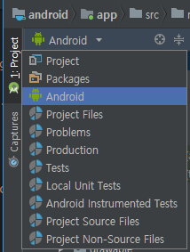
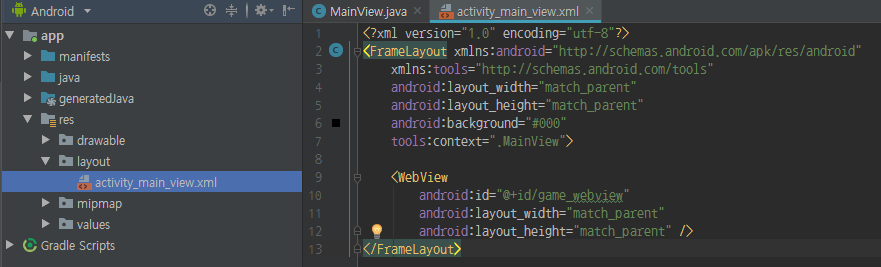
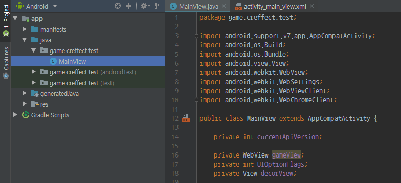
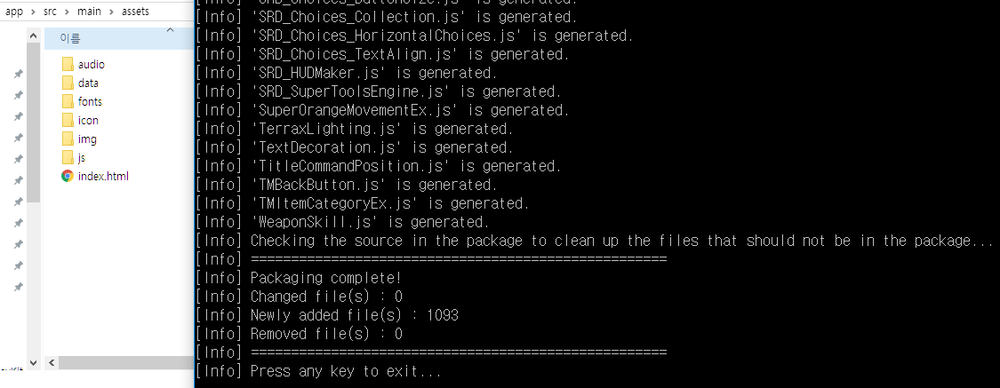
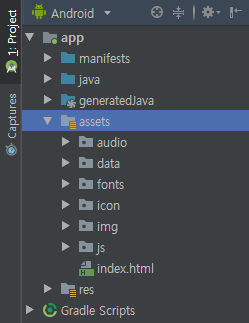
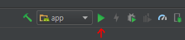

# RPGMakerMV-AndroidDevKit
이것은 RPG Maker MV를 안드로이드로 빌드하는 비공식 개발킷입니다.  
2019년 02월 09일 작성됨. (v1.0)  
2019년 05월 06일 업데이트 됨. (v1.1)  
차후에는 업데이트로 인해 동작이 원활하지 않을 수 있습니다.

# v1.0을 사용하셨던 분들에게

v1.1에는 게임의 세이브를 실제 안드로이드 로컬 스토리지에 저장하는 기능이 생겼습니다.  
v1.0 에서 v1.1 로 마이그레이션 하는 가이드는 **`v1.0 에서 v1.1 로 마이그레이션 하는 법`** 섹션에 있습니다.

# 준비물

- 안드로이드 스튜디오
- RPG MV 프로젝트 폴더

# 준비

이 저장소를 복제하세요. (아니면 ZIP 파일로 받아 압축을 푸세요.)

## 설정 파일 준비하기

`Start Package.bat`을 실행하세요.  
다른 플랫폼에서는 `ApplicationPackager` 를 빌드해야 합니다, [ApplicationPackager 빌드하기](#ApplicationPackager-빌드하기)를 확인하세요.

이제 오류 화면과 함께 이 폴더에 `packager-config.json` 파일이 생깁니다.

## RPG MV

RPG MV 프로젝트를 이 폴더에 넣으세요.  
그러고나서 프로젝트 폴더를 `MV`로 변경하거나 `packager-config.json` 파일을 수정하세요.  
(`rpgmv-path` 에 있는 것을 MV 프로젝트 폴더 이름으로)

그리고 해당 프로젝트에는 `MVRequrements`의 `android-loader.js` 플러그인을 추가해야 합니다.  
이 플러그인을 플러그인 목록 중에 제일 위에 두세요.

## 안드로이드 스튜디오

새 프로젝트를 만들때 `Empty activity` 로 만들어야 합니다.

  
패키지 이름을 기억하세요.

액티비티 이름을 `MainView`, 레이아웃의 이름을 `activity_main_view`로 바꿔서 프로젝트를 생성하면 됩니다.

안드로이드 스튜디오가 프로젝트 생성하는 작업이 끝나면 (Gradle 작업까지 포함), 프로젝트 탐색 뷰를 바꿔야 합니다.  
왼쪽의 Project 탭을 클릭하고, 윗쪽의 드롭다운을 `Android`로 바꿔줍니다.  


이제 `AndroidRequirements/AndroidManifest.xml` 파일의 내용을 이 프로젝트의 매니페스트에 덮어써줍니다.
`YOUR_PACKAGE_NAME_HERE`라고 되어있는 부분을 꼭 패키지 이름으로 바꾸세요.  


`AndroidRequirements/styles.xml`의 내용을 복사해서 프로젝트의 `styles.xml` 내용을 덮어써줍니다.  
  
또 `AndroidRequirements/activity_main_view.xml`의 내용을 복사해서 프로젝트의 `activity_main_view.xml` 내용을 덮어써줍니다.  


이제 매니페스트의 내용에 빨간 텍스트가 표시되지 않는다면 성공입니다.

이제 `MainView`를 열어봅시다.  


이것도 똑같이 `AndroidRequirements/MainView.java` 파일의 내용을 여기에 덮어씌워줍니다.  
역시 `YOUR_PACKAGE_NAME_HERE`를 패키지 이름으로 바꿔주세요.  


그런 다음, 폴더를 우클릭 해서 New - Java Class 메뉴를 통해 새 클래스를 만들어줍니다.  
이름은 `SaveDataManager`으로 해주세요.  
  


`MainView`에 했던 작업과 동일합니다, `AndroidRequirements/SaveDataManager.java`에 있는 내용을 만든 파일 안에 붙여넣으세요.  
역시 `YOUR_PACKAGE_NAME_HERE`를 패키지 이름으로 바꿔야 합니다.  

거의 다 끝났습니다, `assets` 폴더를 만들어봅시다.  
(res 폴더 우클릭, `New - directory - Assets directory`)  
창이 나타난다면, `Finish` 버튼을 클릭하세요.  


## 마무리하기

이제 다시 돌아와서 `packager-config.json` 파일을 열고 내용 중에 `assets-path`를
안드로이드 프로젝트의 `assets` 폴더 경로로 바꿔줍니다.

저장한 다음, `Start Package.bat`을 실행하세요.  
패키저가 이제 MV 프로젝트를 안드로이드 프로젝트로 복사하거나 비교해 파일을 정리할겁니다.  


패키저의 작업이 끝나면, 안드로이드 스튜디오에서 MV 파일들이 안드로이드 프로젝트의
`assets` 폴더 안으로 잘 정리돼서 들어갔다는 것을 알 수 있습니다.  
  

만약에 안드로이드 스튜디오에서 `assets` 폴더 안에 아무것도 보이지 않는다면
`assets` 폴더를 우클릭하고, `Synchornize 'assets'`를 클릭하세요.  


## 테스트하기

와! 드디어 작업이 끝났습니다!  
안드로이드 기기와 USB를 이용해 컴퓨터에 연결한 후
(개발자 모드가 활성화 된 상태로), 초록색 재생 버튼을 클릭하세요.  
  
그러고나서 연결한 기기를 선택하고 MV 게임을 확인해보세요.

> ...잠깐, MV 플러그인에서 오류가 났다!  
> 컴퓨터에서 플레이 할 때는 본 적이 없는데...  
> 이 오류를 어떻게 자세히 확인할 수 있죠?

만약에 안드로이드 기기가 컴퓨터에 연결된 채로 앱을 실행하고 있는 중이라면...  
Chrome을 실행해서 주소창에 `chrome://inspect`를 칩니다.

그러면 해당 페이지에서 잠시 뒤에 연결된 안드로이드 기기를 볼 수 있습니다!  
`Inspect` 버튼을 클릭해서 콘솔 로그를 확인해보세요.  

- 알림 : 원격 디버거는 게임 화면을 표시해주지 못합니다 (HTML Canvas). 안드로이드 기기를 보세요!

더 많은 원격 디버깅에 대한 정보는 여기에서 확인하세요.  
https://developers.google.com/web/tools/chrome-devtools/remote-debugging/webviews

# v1.0 에서 v1.1 로 마이그레이션 하는 법

`MVRequirements` 폴더 안의 `android-loader-for-migration.js` 파일을 받고, 기존에 있던 `android-loader.js`를 같은 이름으로 덮어씁니다.  
그런 다음, `Android studio` 섹션의 `MainView` 부분부터 따라가세요.  

# `ApplicationPackager` 빌드하기

# 준비물

- .NET Core SDK 2.0 또는 그 이상

# 빌드하기

터미널(cmd)를 키고, `ApplicationPackager` 폴더로 이동합니다.  
그리고 아래의 명령을 실행하세요.

```
dotnet restore
dotnet publish -c Release --runtime RID
```
- `RID` 부분을 사용하는 플랫폼으로 바꿔주세요.  
  지원하는 플랫폼 목록은 아래의 주소에서 확인하실 수 있습니다.  
  https://docs.microsoft.com/ko-kr/dotnet/core/rid-catalog  
  (예 : Mac OS의 RID는 `osx-x64`)  
  ```
  dotnet publish -c Release --runtime osx-x64
  ```

빌드가 끝났으면, 상위 폴더로 이동합니다.  
그리고 터미널에서 `./ApplicationPackager/bin/Release/<.NET Core 버전>/<RID>/publish/ApplicationPackager`를 실행해보세요.

잘 동작한다면, 터미널에서 입력했던 명령을 셸 스크립트에 작성해서 나중에 빠르게 실행할 수 있게 하세요.