# RPGMakerMV-AndroidDevKit
This is unofficial RPG Maker MV for Android build kit.  
Posted in 2019-02-09.  
May not work further later.

# Requirements

- Android studio
- RPG MV project directory

# Setup

Clone this repository (or download ZIP and extract) first.

## Prepare config file

Run the `Start Package.bat`.  
Other platforms need to build `ApplicationPackager` for your platforms, see [Build ApplicationPackager](#Build-ApplicationPackager)

Now, you got an error text and `packager-config.json` file.

## RPG MV

Import your RPG MV project directory here.  
And change your directory name to `MV` or edit `packager-config.json` file. (change `rpgmv-path` value)

You must add plugin `MVRequirements/android-loader.js` to your MV project.  
This plugin must be in first line of the plugin list.

## Android studio

Create project with `Empty activity` at here.  

  
Remind your package name.

Set activity's name to `MainView` and layout's name to `activity_main_view`.  

When Android studio is finish to create project (include Gradle jobs), change project view.  
Click Project tab, and click to select dropdown to Android.  
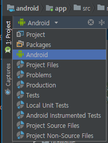

Now, copy `AndroidRequirements/AndroidManifest.xml` contents to your manifest file.  
You must replace `YOUR_PACKAGE_NAME_HERE` to your package name.  
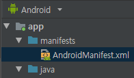

And copy `AndroidRequirements/styles.xml` to overwrite your `styles.xml`.  
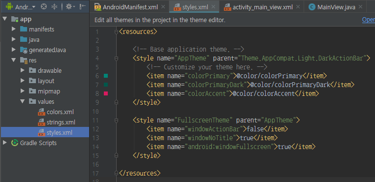  
Also copy `AndroidRequirements/activity_main_view.xml` to overwrite your `activity_main_view.xml`.
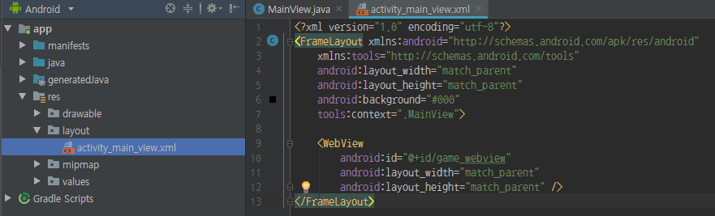

If there is no red text in AndroidManifest.xml, it's a success.

Let's open `MainView`.  
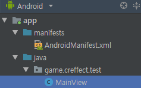

Same before works, copy `AndroidRequirements/MainView.java` contents to replace here.  
Also must replace `YOUR_PACKAGE_NAME_HERE` to your package name.  
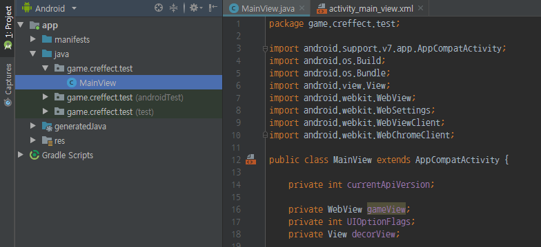

We almost done this job, let's create `assets` directory.  
(Right click res directory, `New - directory - Assets directory`)  
When dialog shows up, just click `Finish` to finish Android job.
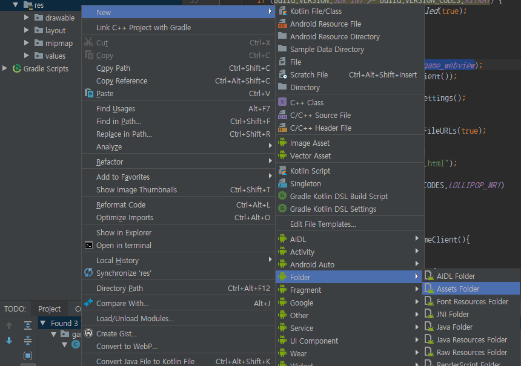

## Finalize

Open `packager-config.json`, and change `assets-path`
to your Android project's `assets` directory path.  

Then, run `Start Package.bat`.  
Packager will copy and comparing to your MV project to your Android project.
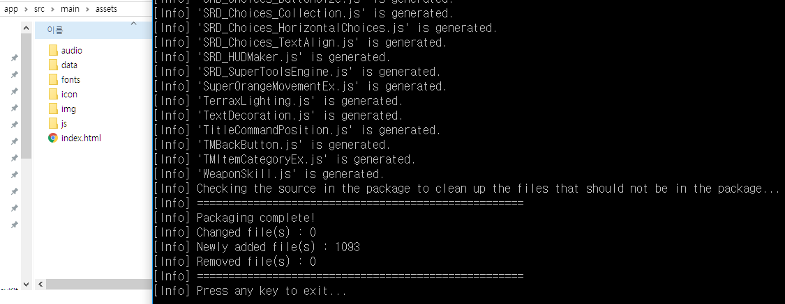

If packager is finish to work, you can see MV files successfully added
your Android project's `assets` folder.  
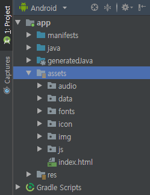  

If anything can't find in `assets` folder, right click `assets` folder
and click `Synchornize 'assets'`.  
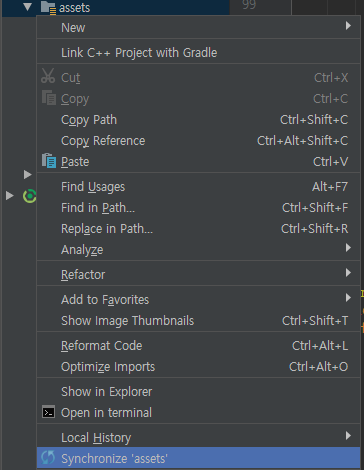

## Testing

Yes! now finally done!  
Connect your android phone to your computer via USB
(with Developer mode enabled), and hit green play icon button.  
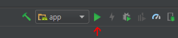  
then, select your device and enjoy your game.

> ...wait, some MV plugin error occured!  
> I never seen it before in desktop play.  
> How can I see error log?

If you keep running your application in connected your Android device then...  
Open the Chrome, and goto `chrome://inspect`.

And some seconds later you can see your device in list!  
Click the `Inspect` and checkout console's log.  
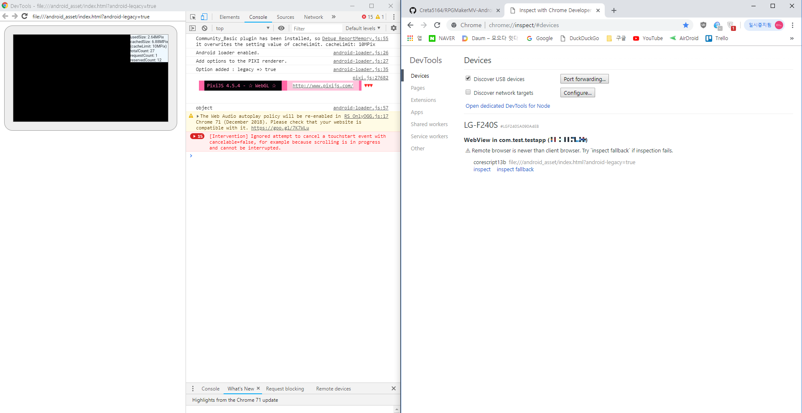
- Note : Inspect debugger can't show game screen (canvas). watch your Android device!

More remote debug information in here.  
https://developers.google.com/web/tools/chrome-devtools/remote-debugging/webviews

# Build `ApplicationPackager`

# Requirements

- .NET Core SDK 2.0 or higher

# Build

Open the terminal(cmd) and locate `ApplicationPackager` directory.  
Then, run below command.

```
dotnet restore
dotnet publish -c Release --runtime RID
```
- Replace `RID` part to build platform target.  
  You can find support platform at here.  
  https://docs.microsoft.com/en-us/dotnet/core/rid-catalog  
  (for example, Mac OS's RID is `osx-x64`)  
  ```
  dotnet publish -c Release --runtime osx-x64
  ```

If finish to build, locate terminal to upper directory.  
and run `./ApplicationPackager/bin/Release/<.NET Core version>/<RID>/publish/ApplicationPackager`.

If works successfully, make it to shell script for shortcut.