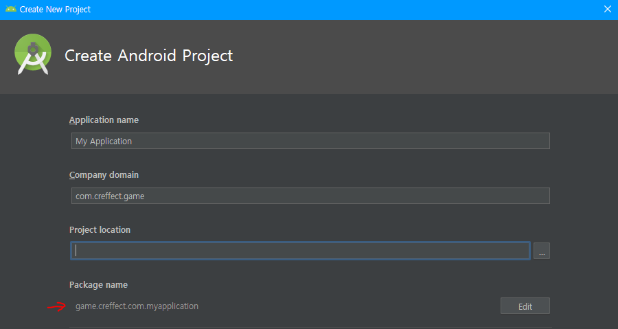
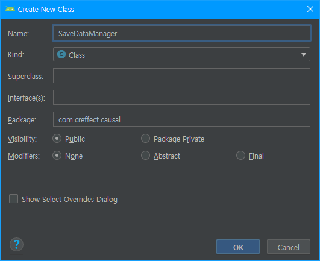
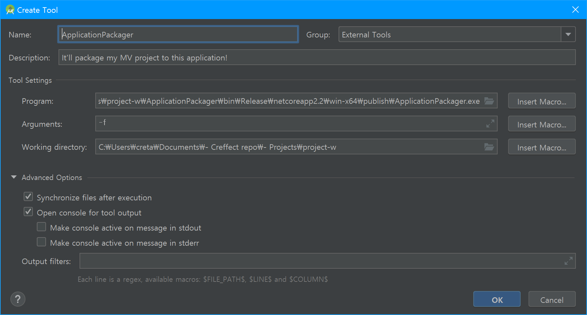

# RPGMakerMV-AndroidDevKit
This is unofficial RPG Maker MV for Android build kit.  
Posted in 2019-02-09. (v1.0)  
Updated in 2019-05-06. (v1.1)  
Updated in 2019-11-23. (v1.1b)  
Updated in 2019-12-14. (v1.2)  
May not work further later.

# Before to read who used v1.0

v1.1 has new feature saving game data to actual Android local storage.  
Migration v1.0 to v1.1 guide is on **`v1.0 to v1.1 migration guide`** section.

# Requirements

- Android studio
- RPG MV project directory

# Setup

Clone this repository (or download ZIP and extract) first.

## If you are not Windows environment

Other platforms need to build `ApplicationPackager` for your platforms, see [Build ApplicationPackager](#Build-ApplicationPackager)

## RPG MV

Import your RPG MV project directory here.  
And rename your project directory to `MV`.

You must add plugin `MVRequirements/android-loader.js` to your MV project.  
This plugin must be in first line of the plugin list.

## Android studio

Create project with `Empty activity` at here.  

  
Remind your package name.

Set activity's name to `MainView` and layout's name to `activity_main_view`.  

When Android studio is finish to create project (include Gradle jobs), change project view.  
Click Project tab, and click to select dropdown to Android.  


Now, copy `AndroidRequirements/AndroidManifest.xml` contents to your manifest file.  
You must replace `YOUR_PACKAGE_NAME_HERE` to your package name.  


And copy `AndroidRequirements/styles.xml` to overwrite your `styles.xml`.  
  
Also copy `AndroidRequirements/activity_main_view.xml` to overwrite your `activity_main_view.xml`.


If there is no red text in AndroidManifest.xml, it's a success.

Let's open `MainView`.  


Same before works, copy `AndroidRequirements/MainView.java` contents to replace here.  
Also must replace `YOUR_PACKAGE_NAME_HERE` to your package name.  
  

And create new class and name to `SaveDataManager`.  
  


Also same as `MainView` works, just copy `AndroidRequirements/SaveDataManager.java` content to paste here.  
And must replace `YOUR_PACKAGE_NAME_HERE` to your package name.  

We almost done this job, let's create `assets` directory.  
(Right click res directory, `New - directory - Assets directory`)  
When dialog shows up, just click `Finish` to finish Android job.


## Finalize

### Setting automation packaging environment

After updated version 1.2, now able to automation build.  
Save MV project and then click test button in Android studio will automate build with fixed part of project and install application in your device directly!  
Let's setting up automation packaging environment!

Click dropdown menu that placed right side of green hammer icon.  
And click `Edit Configurations...` menu.


Then `Run/Debug Configurations` window will appear.  


Click plus sign button in `Before launch: Gradle-aware Make` tab.  
And select `Run External Tool` menu.  


Then you can see `External Tools` window.  
Click the plus sign button in this window.  


Then you can see `Create Tool` window. (again)  
Write `ApplicationPackager` to `Name` field.


Now, we'll setup `Tool Settings` area.  

---

### - `Program` field
Click folder icon and select `<your working directory>/ApplicationPackager/bin/Release/netcoreapp2.2/win-x64/publish/ApplicationPackager.exe` in your directory. (like this)  
  

### - `Arguments` field
Write just `-f` only.  

### - `Working directory` field
Click folder icon and select your currently working directory.

### - `Advenced Options` tab
Check `Synchornize files after execution` and `Open console for tool output` check box.

---

If you finish this instructions, then you'll see like this image.  
  

Hit `OK` button in `Create Tool` window and `External Tools` window.  

And then order that we added `External Tool` item to first in this list!  
(Drag item or click arrow icon to change item's order)  


## Testing

Yes! now finally done!  
Connect your android phone to your computer via USB
(with Developer mode enabled), and hit green play icon button.  
  
then, select your device and enjoy your game.  
> Note : If you got stucked in `ApplicationPackager` build error like `Please edit 'packager-config.json' to setup packaging environment.`, you need to edit to config `packager-config.json` file manually in your working directory.
  
> - `rpgmv-path` : Must be specified RPG MV project directory path.   
> - `assets-path` : Must be specified `assets` directory, normally placed in `<Android Studio project folder>/app/src/main/` directory.
> 
> 


*...wait, some MV plugin error occured!*  
*I never seen it before in desktop play.*  
*How can I see error log?*

If you keep running your application in connected your Android device then...  
Open the Chrome, and goto `chrome://inspect`.

And some seconds later you can see your device in list!  
Click the `Inspect` and checkout console's log.  

- Note : Inspect debugger can't show game screen (canvas). watch your Android device!

More remote debug information in here.  
https://developers.google.com/web/tools/chrome-devtools/remote-debugging/webviews

# v1.0 to v1.1 migration guide

Download `MVRequirements/android-loader-for-migration.js` file, and replace old `android-loader.js` in your project.  
Then, follow `Android studio` section's part, `MainView` guidance.

# Build `ApplicationPackager`

# Requirements

- .NET Core SDK 2.0 or higher

# Build

Open the terminal(cmd) and locate `ApplicationPackager` directory.  
Then, run below command.

```
dotnet restore
dotnet publish -c Release --runtime RID
```
- Replace `RID` part to build platform target.  
  You can find support platform at here.  
  https://docs.microsoft.com/en-us/dotnet/core/rid-catalog  
  (for example, Mac OS's RID is `osx-x64`)  
  ```
  dotnet publish -c Release --runtime osx-x64
  ```

If finish to build, locate terminal to upper directory.  
and run `./ApplicationPackager/bin/Release/<.NET Core version>/<RID>/publish/ApplicationPackager`.

If works successfully, make it to automation in your IDE when before build, check **`Finalize`** section.  
This program contains force mode(Execution parameter : `-f`) which will ignore all user input.  
